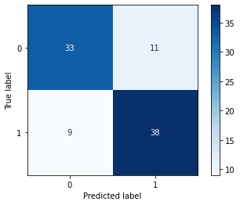
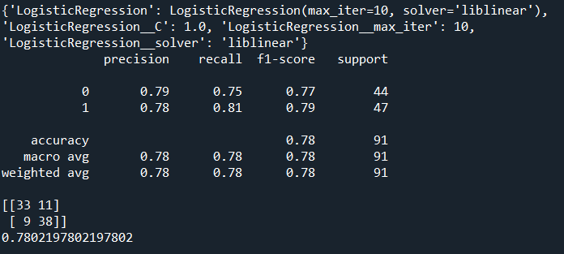
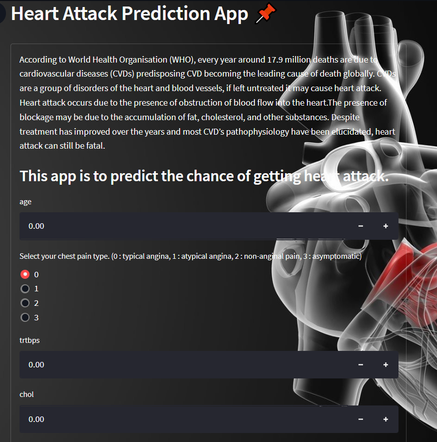
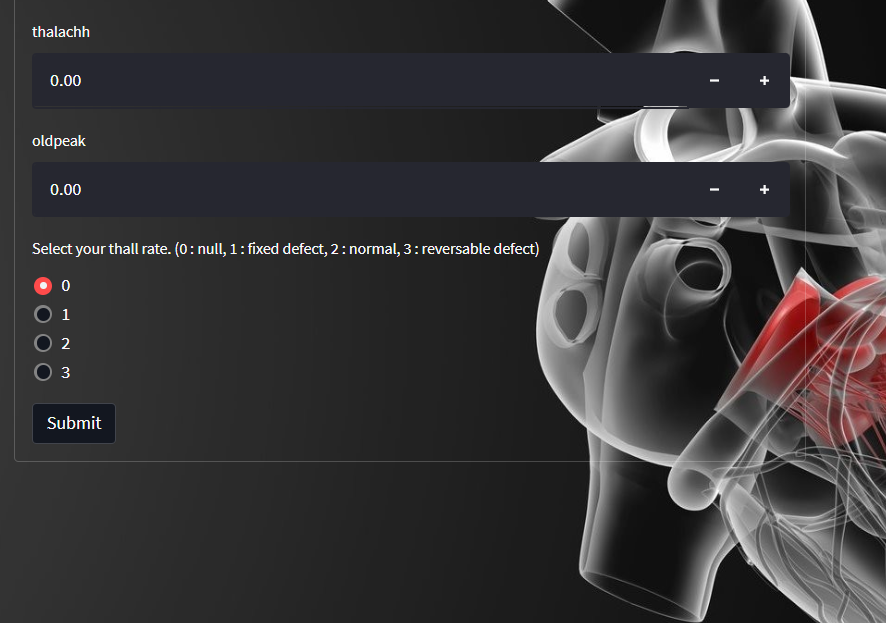

# Heart-Attack-Prediction
 Trained and predicting the chance of getting heart attack.

## Description
In this model our objective is to predict the possibility that a person might have a chance of getting a heart attack.
A heart attack (myocardial infarction or MI) is a serious medical emergency in which the supply of blood to the heart is suddenly blocked, usually by a blood clot. A heart attack is a medical emergency. Thus, a precaution step must be taken to avoid any unwanted event.

## Results
The best pipeline to be use in this model is Logistic Regression and MinMax Scaler.

## Discussion
From this model, around 78% accuracy can be achieved during training. Although the accuracy only around 78%, it can be improved by adding more data to it.

## Application
By using this model developed, an app is created to be used for predicting the possibility of a person to have heart attack depending on a certain features.

## Credits
The data for this project is downloaded from kaggle.
[kaggle](https://www.kaggle.com/rashikrahmanpritom/heart-attack-analysisprediction-dataset)

